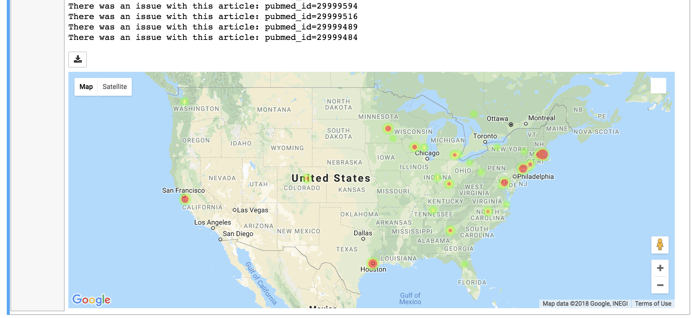

# api_pubmed

Pulls publications based on a user query and plots a heatmap of research hotspots. Currently only supports PubMed based searches for affiliations that include a full university name.

